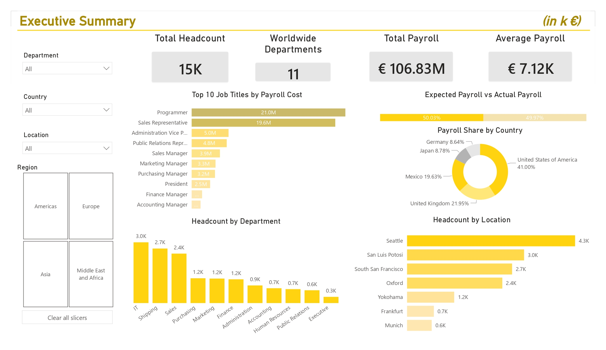
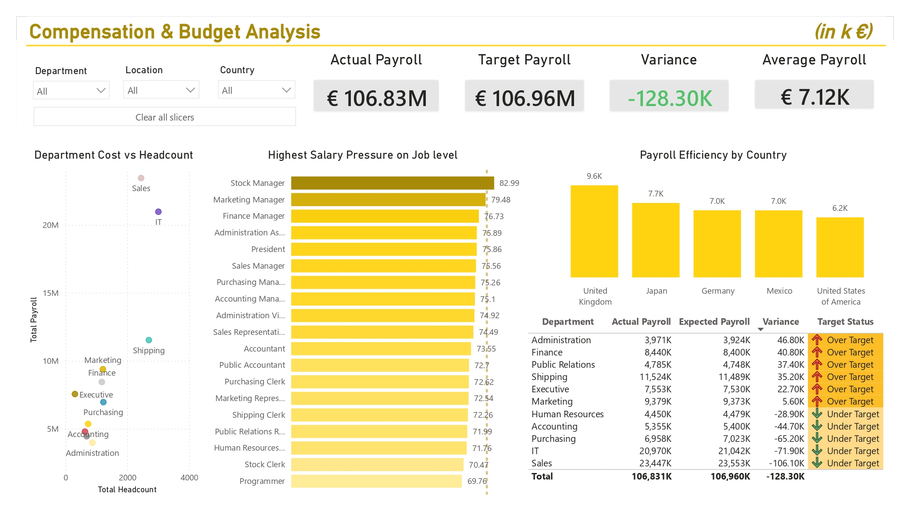
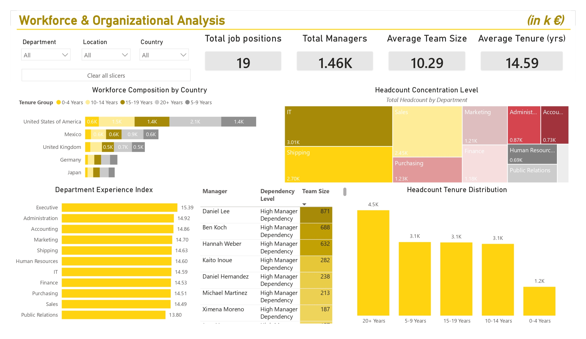

# Enterprise HR Analytics Dashboard | MySQL & Power BI
> *An end-to-end HR Analytics project leveraging MySQL and Power BI to transform workforce data into strategic business insights, helping organizations optimize payroll spending, monitor compensation risks, and support data-driven workforce planning.*

---

## ⚙️ Project Type Flags
- [ ] Exploratory Data Analysis (EDA)
- [ ] SQL Analysis / Querying
- [ ] Dashboard / Data Visualization
- [ ] Data Cleaning / Wrangling
- [ ] End-to-End Analytics Project

---

## Project Highlights

- 📊 15,000+ employee records analyzed
- 🗄️ Relational MySQL database with 6 interconnected tables
- 💻 30+ SQL queries using JOINs, CTEs, Subqueries, CASE, and Window Functions
- 📈 3 interactive Power BI dashboard pages
- 📐 Entity Relationship Diagram (ERD) designed in dbdiagram.io
- 🎯 End-to-end project covering data enrichment, SQL analysis, and business intelligence

---

## Table of Contents
1. [Project Overview](#1-project-overview)
2. [Objectives](#2-objectives)
3. [Project Scope & Tools](#3-project-scope--tools)
4. [Repository Structure](#4-repository-structure)
5. [Data Workflow](#5-data-workflow)
6. [Data Model & Schema](#6-data-model--schema)
7. [ERD - Entity Relationship Diagram](#7-erd--entity-relationship-diagram) *(SQL projects)*
8. [Analysis & Metrics](#8-analysis--metrics)
9. [Key Insights](#9-key-insights)
10. [Recommendations](#10-recommendations)
11. [Assumptions & Limitations](#11-assumptions--limitations)
12. [Future Enhancements](#12-future-enhancements)
13. [Deliverables](#13-deliverables)
14. [Author](#14-author)

---

## 1. Project Overview


**Context:** Human Resources departments generate large volumes of workforce data but often lack the analytical tools required to transform that data into actionable business insights.

Organizations need visibility into workforce distribution, payroll expenditure, departmental performance, compensation structures, and management effectiveness.

**Problem Statement:** As organizations grow, managing workforce costs and understanding organizational performance becomes increasingly complex. Without a centralized analytical framework, identifying payroll inefficiencies, budget variances, compensation risks, and management dependencies can be difficult and time-consuming.

This project addresses these challenges by transforming workforce data into a comprehensive HR Analytics solution that provides visibility into employee, compensation, and organizational metrics, enabling more effective workforce planning and strategic decision-making.

**Approach:** The project follows an end-to-end analytics approach, leveraging SQL to uncover workforce, compensation, and organizational insights before translating those findings into executive-level Power BI dashboards. This enables stakeholders to monitor key HR metrics and make informed strategic decisions.

**Outcome:** The outcome of the project is a decision-support tool that helps HR leaders and executives understand workforce trends, evaluate compensation strategies, and identify organizational risks. By consolidating data into interactive dashboards, the solution improves visibility and supports strategic planning.

---

## 2. Dashboard Preview

### Executive Summary



---

### Compensation & Budget Analysis



---

### Workforce & Organizational Analysis




## Dashboard Demo


---

## 3. Objectives


- **Primary Objective:** Build an end-to-end HR Analytics solution that transforms workforce data into actionable business insights through advanced SQL analysis and interactive Power BI reporting.
- **Secondary Objective 1:** Quantify workforce distribution, payroll allocation, and compensation structures across departments, countries, and organizational units.
- **Secondary Objective 2:** Identify payroll inefficiencies, budget variances, salary pressure, and management dependencies that may impact workforce planning and organizational performance.
- **Secondary Objective 3:** Develop executive-level dashboards that enable stakeholders to monitor key HR metrics and support data-driven decision-making.

---

## 4. Project Scope & Tools

### Scope

| Dimension | Details |
|-----------|---------|
| **In Scope** | Employees, Jobs, Departments, Countries, Regions, Locations |
| **Out of Scope** | Attrition modelling, performance reviews, recruitment data |
| **Time Period** | Simulated historical workforce data |
| **Granularity** | Employee-level records |

### Tools & Technologies


| Category | Tool(s) Used |
|----------|-------------|
| Data Storage | MySQL |
| Data Processing | SQL |
| Analysis | MySQL Queries |
| Visualization | Power BI |
| Version Control | GitHub |
| ERD Design | dbdiagram.io |

---

## 5. Repository Structure

```
[HR-Analytics]/
│
├── data/
│   ├── raw/                  # Original, unmodified source data - never edited
│   ├── processed/            # Cleaned and transformed data
│
├── power-bi/                 # Interactive .pbix 
│
├── queries/                  # SQL files (retain this folder for SQL-heavy projects)
│   ├── exploratory/          # Ad-hoc or investigative queries
│   ├── transformations/      # Cleaning and reshaping logic
│   ├── advanced_analysis/    # Business-focused SQL queries
│   └── final/                # Production-ready or presentation queries
│
├── visuals/                  # Exported charts, dashboard screenshots, ERD diagrams
│
└── README.md                 # You are here
```

---

## 6. Data Workflow

```
[Data Source]
      ↓
[Data Enrichment]
      ↓
[Data Standardization]
      ↓
[Data Validation & Cleaning]
      ↓
[Transformation]
      ↓
[Analysis]
      ↓
[Output]
```


  1. Source: The project is based on a relational HR database containing information about employees, departments, jobs, locations, countries, and regions. The original dataset consisted of approximately 40 employee records and was intended primarily for database learning purposes rather than large-scale workforce analytics
  2. Data Enrichment: To create a dataset suitable for meaningful analysis, the employee table was expanded from 39 to over 15,000 records. New employee records were generated while preserving realistic business rules, including department assignments, management hierarchies, salary ranges, hire dates, and job classifications.
The geographical structure of the dataset was also enhanced to better reflect a multinational organization. Several locations were updated to improve global representation, including replacing Toronto with Yokohama (Japan), Southlake with San Luis Potosí (Mexico), and London with Frankfurt (Germany).
  3. Data Standardization: Employee attributes were aligned with their assigned locations to improve data consistency and realism. First and last names were adjusted to better reflect the dominant nationality of the country in which employees were located, while still allowing for a limited number of international employees. Telephone numbers were also standardized to follow country-specific formats based on each employee’s location.
  Additionally, the dependents table was removed from the analytical scope, as dependent information was not relevant to the workforce, compensation, and organizational analyses performed in this project.
  4. Data Validation & Cleaning: Before analysis, the dataset was validated to ensure referential integrity across all relationships. Salary values were checked against the minimum and maximum salary bands defined for each job role, department assignments were verified against existing locations, and management hierarchies were reviewed to ensure employees were linked to valid managers where applicable.
  5. Transformation: Several analytical metrics were derived to support business-focused analysis, including payroll variance, payroll efficiency by country, salary pressure relative to job salary bands, management span of control, workforce tenure, and department-level compensation indicators.
  6. Analysis: The enriched dataset was analyzed using two stages of SQL analysis. The first stage focused on Exploratory Data Analysis (EDA) to understand workforce composition, payroll distribution, and geographic allocation. The second stage applied advanced SQL techniques, including JOINs, self-JOINs, CTEs, subqueries, and CASE statements, to answer business-oriented questions related to compensation, budgeting, workforce planning, and organizational structure.
  7. Output: The final deliverables include a cleaned and enriched HR database, SQL scripts for both exploratory and advanced analysis, an Entity Relationship Diagram (ERD), and a three-page interactive Power BI dashboard

---

## 7. Data Model & Schema

<!--
  Define your fields so that someone reading your analysis can follow along
  without digging through your code.

  WHAT GOOD LOOKS LIKE (one row example):
  | transaction_id | string | Unique identifier per sales transaction | TXN-00482 |
  | return_flag    | boolean | Whether the transaction included a return | TRUE |
  | region_code    | string | Two-letter identifier for store region | "NE" |

  WHAT TO AVOID:
  ❌ Skipping this section because "the field names are self-explanatory."
     They're not. Not to a reviewer. Not to you in six months.

  📌 FOR SQL PROJECTS: If you have multiple tables, create one block per table.
     Describe join keys and relationships here. Your ERD (Section 7) will
     visualise what this section describes in text.

  📌 FOR NON-SQL PROJECTS: Describe the shape of your dataset informally
     if a formal schema doesn't apply. Even one paragraph is more helpful than nothing.
-->

### Dataset / Table: `employees`

| Field Name | Data Type | Description | Example Value |
|------------|-----------|-------------|---------------|
| `employee_id` | INT | Unique identifier for each employee | 100 |
| `first_name` | VARCHAR | Employee first name | Steven |
| `last_name` | VARCHAR | Employee last name | King |
| `email` | VARCHAR | Employee email address | steven.king@success.com |
| `phone_number` | VARCHAR | Country-formatted employee phone number | +49 069 123456 |
| `hire_date` | DATE | Date when the employee joined the company | 1998-03-24 |
| `job_id` | INT | Foreign key linking the employee to a job role | 9 |
| `salary` | DECIMAL | Employee salary aligned with the job salary range | 9000.00 |
| `manager_id` | INT | Self-referencing key identifying the employee’s manager | 100 |
| `department_id` | INT | Foreign key linking the employee to a department | 6 |

> **Row count (approx.):** 15,000 
> **Primary key:** `employee_id` 
> **Key relationships:**  
`employees.job_id → jobs.job_id`  
`employees.department_id → departments.department_id`  
`employees.manager_id → employees.employee_id`

### Table: `jobs`

| Field Name | Data Type | Description | Example Value |
|---|---|---|---|
| `job_id` | INT | Unique identifier for each job role | 9 |
| `job_title` | VARCHAR | Name of the job position | Programmer |
| `min_salary` | DECIMAL | Minimum salary allowed for the job role | 4000.00 |
| `max_salary` | DECIMAL | Maximum salary allowed for the job role | 10000.00 |

> **Primary key:** `job_id`  
> **Key relationship:**  
`jobs.job_id → employees.job_id`

---

### Table: `departments`

| Field Name | Data Type | Description | Example Value |
|---|---|---|---|
| `department_id` | INT | Unique identifier for each department | 6 |
| `department_name` | VARCHAR | Name of the department | IT |
| `location_id` | INT | Foreign key linking the department to a location | 1400 |

> **Primary key:** `department_id`  
> **Key relationship:**  
`departments.location_id → locations.location_id`

---

### Table: `locations`

| Field Name | Data Type | Description | Example Value |
|---|---|---|---|
| `location_id` | INT | Unique identifier for each company location | 1400 |
| `street_address` | VARCHAR | Street address of the location | 2014 Jabberwocky Rd |
| `postal_code` | VARCHAR | Postal or ZIP code of the location | 78395 |
| `city` | VARCHAR | City where the office is located | San Luis Potosí |
| `state_province` | VARCHAR | State, province, or regional subdivision | San Luis Potosí |
| `country_id` | CHAR | Foreign key linking the location to a country | MX |

> **Primary key:** `location_id`  
> **Key relationship:**  
`locations.country_id → countries.country_id`

---

### Table: `countries`

| Field Name | Data Type | Description | Example Value |
|---|---|---|---|
| `country_id` | CHAR | Two-letter country identifier | MX |
| `country_name` | VARCHAR | Full country name | Mexico |
| `region_id` | INT | Foreign key linking the country to a region | 2 |

> **Primary key:** `country_id`  
> **Key relationship:**  
`countries.region_id → regions.region_id`

---

### Table: `regions`

| Field Name | Data Type | Description | Example Value |
|---|---|---|---|
| `region_id` | INT | Unique identifier for each geographic region | 2 |
| `region_name` | VARCHAR | Name of the geographic region | Americas |

> **Primary key:** `region_id`

---

### Relationship Summary

| Relationship | Join Key | Type |
|---|---|---|
| `regions → countries` | `regions.region_id = countries.region_id` | One-to-Many |
| `countries → locations` | `countries.country_id = locations.country_id` | One-to-Many |
| `locations → departments` | `locations.location_id = departments.location_id` | One-to-Many |
| `departments → employees` | `departments.department_id = employees.department_id` | One-to-Many |
| `jobs → employees` | `jobs.job_id = employees.job_id` | One-to-Many |
| `employees → employees` | `employees.employee_id = employees.manager_id` | Self-Join / Manager Hierarchy |


---

## 8. ERD - Entity Relationship Diagram

The following diagram illustrates the relational structure of the HR database used throughout the project.

![ERD Diagram][(visuals/ERD Diagram.png)](https://github.com/antoniafraseniuc/hr-analytics-project/blob/09d3c1a8f3d50818dc22d40db4b992718a38d2b6/visuals/ERD%20Diagram.png)
*Relational HR database connecting employees, jobs, departments, locations, countries and regions through hierarchical relationships.*

---

## 9. Analysis & Metrics

### Analytical Approach

The analysis was conducted using a combination of exploratory and business-focused techniques. The initial phase focused on understanding workforce composition, compensation distribution, and organizational structure through Exploratory Data Analysis (EDA). Once the data had been validated and enriched, the analysis shifted toward answering specific business questions related to payroll allocation, budget utilization, compensation efficiency, workforce experience, and managerial responsibility. The objective was not only to describe the workforce but also to identify patterns and potential risks that could influence strategic HR and financial decisions.

### Key Metrics Defined

| Metric | Plain-Language Definition | Why It Matters |
|--------|--------------------------|----------------|
| `Payroll Variance` | The difference between actual payroll spending and the expected payroll cost based on salary ranges for each role. | Helps identify departments operating above or below their planned compensation budget. |
| `Salary Pressure` | The percentage of an employee's salary relative to the maximum salary allowed for their job position. | Highlights roles that may face retention risks due to limited room for future salary growth. |
| `Payroll Efficiency` | Average payroll cost per employee within a country or location. | Allows comparison of compensation costs across geographic regions. |
| `Team Size` | The number of employees reporting to a specific manager. | Helps identify management workload and organizational dependency risks. |
| `Workforce Tenure` | The average number of years employees have been employed by the organization. | Indicates workforce stability, experience levels, and succession planning needs. |
| `Payroll Concentration` | The proportion of total payroll allocated to a department. | Identifies departments with the greatest financial impact on overall workforce costs. |

### Methods Used

- Descriptive statistics to evaluate workforce, salary, and payroll distributions.
- Department, country, and location-level segmentation to compare organizational units.
- Business-rule-based calculations to derive payroll variance and salary pressure metrics.
- Self-JOIN analysis to evaluate management structures and reporting hierarchies.
- Common Table Expressions (CTEs) to simplify complex payroll and budget calculations.
- Comparative analysis of workforce and compensation metrics across organizational dimensions.
- Interactive dashboard reporting through Power BI to support stakeholder exploration.

---

## 10. Key Insights


**Insight 1: Payroll spending is concentrated within a small number of departments**
The Sales and IT departments account for the largest share of total payroll expenditure. This suggests that workforce planning decisions within these departments have a disproportionate impact on organizational costs and should therefore receive increased attention during budgeting and resource allocation exercises.

**Insight 2: Overall compensation spending remains aligned with budget expectations**
The organization operates slightly below its projected payroll budget, indicating that salary expenditure is generally consistent with planned compensation structures. While this suggests effective budget control, departmental-level analysis reveals that some departments exceed their expected payroll targets while others operate below them.

**Insight 3: Certain job positions exhibit elevated salary pressure**
Several roles, including Stock Managers, Marketing Managers, and Finance Managers, operate close to the upper limit of their salary bands. This may indicate future retention risks, as employees in these positions have limited opportunities for salary progression without promotion or salary band adjustments.

**Insight 4: Significant compensation differences exist across countries**
Payroll efficiency varies considerably across geographic locations, with some countries exhibiting substantially higher payroll costs per employee than others. This suggests that workforce location plays an important role in overall compensation expenditure and should be considered in future workforce planning initiatives.

**Insight 5: Organizational dependency risks exist within management structures**
A small number of managers supervise disproportionately large teams. While this may improve administrative efficiency, it also creates potential succession and operational risks if key managers leave the organization or become unavailable.

---

## 11. Recommendations

<!--
  Action-oriented. Addressed to a real audience.
  Tied explicitly to the insight that supports each one.

  WHAT GOOD LOOKS LIKE:
  Priority: High
  Recommendation: "Conduct a fulfilment audit for home goods deliveries
                   in Region A - specifically investigating whether returns
                   correlate with a particular warehouse, carrier, or SKU batch."
  Based On: Insight 1 - return rate anomaly in Region A
  Owner: Operations / Supply Chain team

  WHAT TO AVOID:
  ❌ "Improve the return rate."
     (Not actionable. Doesn't say who, how, or where to start.)
  ❌ "Further analysis is needed."
     (This is a placeholder, not a recommendation.)
-->

| Priority | Recommendation | Based On | Suggested Owner |
|----------|---------------|----------|-----------------|
| High | Review job positions operating above 80% salary pressure and evaluate whether promotion pathways or salary band adjustments are required. | Insight 3 – Elevated Salary Pressure | HR & Compensation Team |
| Medium | Analyze workforce allocation strategies within Sales and IT to ensure payroll expenditure remains aligned with business value and productivity.| Insight 1 – Payroll Concentration | Department Leadership |
| Low | Investigate compensation differences between countries and locations to determine whether workforce distribution can be optimized without impacting business performance. | Insight 4 – Geographic Compensation Differences | Workforce Planning Team |

---

## 12. Assumptions & Limitations


### Assumptions
- Salary ranges defined within the jobs table accurately represent the compensation framework of the organization.
- Generated employee records follow realistic workforce distributions and organizational structures.
- Employees were assumed to belong to a single department and report to a single manager at any given time.
- Country-specific names and telephone formats were assumed to reasonably represent local workforce characteristics.

### Limitations
- The dataset was synthetically expanded from an original sample of approximately 40 employees and therefore does not represent a real organization.
- Employee performance, productivity, and attrition data were unavailable and could not be incorporated into the analysis.
- Compensation analysis focuses exclusively on salary and does not include bonuses, benefits, stock options, or other forms of remuneration.
- Workforce planning recommendations are based solely on available HR data and do not account for external business or market conditions.

  *A more comprehensive version of this project would incorporate employee performance indicators, recruitment data, turnover history, and workforce forecasting models to provide a more complete view of organizational effectiveness.*


---

## 13. Future Enhancements


- [ ] Incorporate employee attrition and turnover data to analyze workforce retention patterns.
- [ ] Develop workforce forecasting models to estimate future staffing requirements and payroll costs.
- [ ] Integrate employee performance metrics to evaluate compensation effectiveness and workforce productivity.
- [ ] Expand the Power BI solution with drill-through pages and department-level reporting.
- [ ] Automate data generation and refresh processes through scheduled ETL pipelines.
- [ ] Publish the dashboard through Power BI Service to support online sharing and stakeholder access.

---


## 14. Deliverables

| Deliverable | Description | Location |
|---|---|---|
| EDA Analysis | Exploratory SQL queries | `queries/exploratory/` |
| Advanced Analysis | Business-focused SQL queries | `queries/advanced_analysis/` |
| Power BI Dashboard | Three-page interactive dashboard | `Power BI Dashboard/` |
| ERD Diagram | Database relationship diagram | `visuals/` |

---

## 15. Author

**Fraseniuc Nicoleta Antonia**
Budding Data Analyst

- 🔗 https://www.linkedin.com/in/antonia-fraseniuc-75664018b/
- 💼 https://github.com/antoniafraseniuc/hr-analytics-project
- 📧 antonia.fraseniuc100@gmail.com

---

*Last updated: June 2026*


